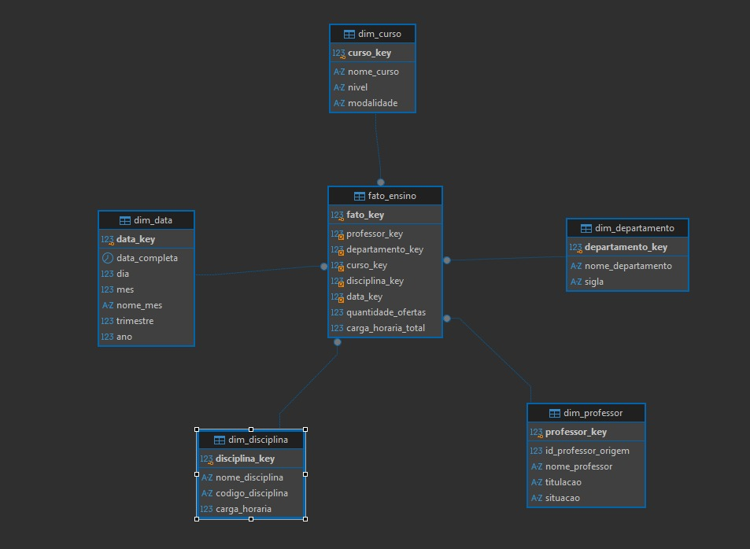

# Data Warehouse de Professores - Star Schema

Este projeto foi desenvolvido para criar um ambiente de análise acadêmica em formato de Data Warehouse, seguindo o modelo dimensional em estrela (Star Schema). A ideia central é transformar dados transacionais em informações estratégicas, permitindo consultas analíticas sobre docentes, departamentos, cursos, disciplinas e períodos.

A solução foi implementada em MySQL e organizada para apoiar decisões de negócio, relatórios institucionais e análises de desempenho acadêmico.

---

## Objetivo do projeto

O objetivo principal é estruturar um modelo analítico que permita responder perguntas como:

- Quantas ofertas de disciplina cada professor realizou?
- Qual a carga horária total por departamento, curso e disciplina?
- Como o volume de ensino se comporta ao longo do tempo?
- Quais docentes e áreas acadêmicas têm maior concentração de atividades?

Com isso, o projeto facilita a análise de indicadores do ensino superior e a consolidação de dados em uma visão multidimensional, ideal para BI e dashboards.

---

## Visão geral do modelo

O modelo foi pensado para representar o cenário acadêmico em uma estrutura de estrela, composta por:

- 1 tabela fato central: `fato_ensino`
- 5 tabelas de dimensão:
  - `dim_professor`
  - `dim_departamento`
  - `dim_curso`
  - `dim_disciplina`
  - `dim_data`

Essa abordagem permite consultas rápidas e organizadas para análise histórica e comparativa.

---

## Estrutura do Star Schema

### Tabela fato

`fato_ensino`

Responsável por armazenar os eventos de ensino, com os indicadores principais:

- `quantidade_ofertas`
- `carga_horaria_total`
- chaves estrangeiras para cada dimensão

### Dimensões

- `dim_professor`: dados do professor como nome, titulação e situação.
- `dim_departamento`: informações do departamento e sua sigla.
- `dim_curso`: nome, nível e modalidade do curso.
- `dim_disciplina`: disciplina, código e carga horária.
- `dim_data`: data completa, dia, mês, trimestre e ano.

---

## Diagrama do modelo

A imagem abaixo apresenta a estrutura relacional do projeto, mostrando a tabela fato conectando-se diretamente às dimensões.



---

## Tecnologias utilizadas

- MySQL 8.0+
- SQL (DDL e DML)
- DBeaver
- Modelagem dimensional em Star Schema

---

## Como executar o projeto

1. Clone o repositório:

```bash
git clone https://github.com/PauloAllan/dw-professores-star-schema.git
```

2. Acesse a pasta do projeto:

```bash
cd dw-professores-star-schema
```

3. Importe o script SQL no MySQL:

```bash
mysql -u seu_usuario -p < script_universit.sql
```

4. Verifique a base criada e execute consultas para validar os dados.

---

## Script do projeto

O script completo do banco e do modelo dimensional está disponível no arquivo [script_universit.sql](script_universit.sql). Ele cria o banco, as tabelas, popula as dimensões e registra os registros na tabela fato.

```sql
CREATE DATABASE IF NOT EXISTS dw_professores;
USE dw_professores;

CREATE TABLE dim_professor (
    professor_key INT AUTO_INCREMENT PRIMARY KEY,
    id_professor_origem INT,
    nome_professor VARCHAR(100) NOT NULL,
    titulacao VARCHAR(60),
    situacao VARCHAR(30)
) ENGINE=InnoDB;

CREATE TABLE dim_departamento (
    departamento_key INT AUTO_INCREMENT PRIMARY KEY,
    nome_departamento VARCHAR(100) NOT NULL,
    sigla VARCHAR(20)
) ENGINE=InnoDB;

CREATE TABLE dim_curso (
    curso_key INT AUTO_INCREMENT PRIMARY KEY,
    nome_curso VARCHAR(100) NOT NULL,
    nivel VARCHAR(50),
    modalidade VARCHAR(50)
) ENGINE=InnoDB;

CREATE TABLE dim_disciplina (
    disciplina_key INT AUTO_INCREMENT PRIMARY KEY,
    nome_disciplina VARCHAR(100) NOT NULL,
    codigo_disciplina VARCHAR(20),
    carga_horaria INT
) ENGINE=InnoDB;

CREATE TABLE dim_data (
    data_key INT PRIMARY KEY,
    data_completa DATE NOT NULL,
    dia INT NOT NULL,
    mes INT NOT NULL,
    nome_mes VARCHAR(20) NOT NULL,
    trimestre INT NOT NULL,
    ano INT NOT NULL
) ENGINE=InnoDB;

CREATE TABLE fato_ensino (
    fato_key INT AUTO_INCREMENT PRIMARY KEY,
    professor_key INT NOT NULL,
    departamento_key INT NOT NULL,
    curso_key INT NOT NULL,
    disciplina_key INT NOT NULL,
    data_key INT NOT NULL,
    quantidade_ofertas INT NOT NULL DEFAULT 1,
    carga_horaria_total INT NOT NULL DEFAULT 0,
    CONSTRAINT fk_fato_professor FOREIGN KEY (professor_key) REFERENCES dim_professor(professor_key),
    CONSTRAINT fk_fato_departamento FOREIGN KEY (departamento_key) REFERENCES dim_departamento(departamento_key),
    CONSTRAINT fk_fato_curso FOREIGN KEY (curso_key) REFERENCES dim_curso(curso_key),
    CONSTRAINT fk_fato_disciplina FOREIGN KEY (disciplina_key) REFERENCES dim_disciplina(disciplina_key),
    CONSTRAINT fk_fato_data FOREIGN KEY (data_key) REFERENCES dim_data(data_key)
) ENGINE=InnoDB;

INSERT INTO dim_professor (id_professor_origem, nome_professor, titulacao, situacao) VALUES
(101, 'Carlos Almeida', 'Mestre', 'Ativo'),
(102, 'Mariana Santos', 'Doutora', 'Ativo'),
(103, 'Joao Ferreira', 'Especialista', 'Ativo');

INSERT INTO dim_departamento (nome_departamento, sigla) VALUES
('Departamento de Tecnologia', 'DTI'),
('Departamento de Gestao', 'DG');

INSERT INTO dim_curso (nome_curso, nivel, modalidade) VALUES
('Gestao da Tecnologia da Informacao', 'Graduacao', 'Presencial'),
('Sistemas de Informacao', 'Graduacao', 'Presencial'),
('Banco de Dados', 'Tecnico', 'Presencial');

INSERT INTO dim_disciplina (nome_disciplina, codigo_disciplina, carga_horaria) VALUES
('Banco de Dados', 'BD101', 60),
('Programacao', 'PR101', 80),
('Gestao de Projetos', 'GP101', 40);

INSERT INTO dim_data (data_key, data_completa, dia, mes, nome_mes, trimestre, ano) VALUES
(20260115, '2026-01-15', 15, 1, 'Janeiro', 1, 2026),
(20260210, '2026-02-10', 10, 2, 'Fevereiro', 1, 2026),
(20260320, '2026-03-20', 20, 3, 'Marco', 1, 2026),
(20260405, '2026-04-05', 5, 4, 'Abril', 2, 2026),
(20260801, '2026-08-01', 1, 8, 'Agosto', 3, 2026);

INSERT INTO fato_ensino (professor_key, departamento_key, curso_key, disciplina_key, data_key, quantidade_ofertas, carga_horaria_total) VALUES
(1, 1, 1, 1, 20260115, 1, 60),
(1, 1, 2, 2, 20260210, 1, 80),
(2, 2, 1, 3, 20260320, 1, 40),
(2, 1, 3, 1, 20260405, 1, 60),
(3, 1, 2, 2, 20260801, 1, 80);

SELECT 
    p.nome_professor,
    dep.nome_departamento,
    c.nome_curso,
    dis.nome_disciplina,
    d.data_completa,
    d.ano,
    f.quantidade_ofertas,
    f.carga_horaria_total
FROM fato_ensino f
INNER JOIN dim_professor p ON f.professor_key = p.professor_key
INNER JOIN dim_departamento dep ON f.departamento_key = dep.departamento_key
INNER JOIN dim_curso c ON f.curso_key = c.curso_key
INNER JOIN dim_disciplina dis ON f.disciplina_key = dis.disciplina_key
INNER JOIN dim_data d ON f.data_key = d.data_key;
```

---

## Exemplo de consulta analítica

```sql
SELECT
    p.nome_professor,
    SUM(f.quantidade_ofertas) AS total_ofertas,
    SUM(f.carga_horaria_total) AS carga_horaria_total
FROM fato_ensino f
JOIN dim_professor p ON p.professor_key = f.professor_key
GROUP BY p.nome_professor
ORDER BY total_ofertas DESC;
```

Essa consulta permite visualizar rapidamente o volume de atividades de ensino por professor.

---

## Conclusão

Este projeto demonstra como um ambiente acadêmico pode ser modelado para análise de dados de maneira eficiente, organizada e escalável. O uso de um Star Schema facilita consultas analíticas, melhora a legibilidade dos dados e oferece uma base sólida para relatórios, dashboards e tomadas de decisão.

Se você quiser evoluir o projeto, as próximas etapas podem incluir:

- criação de mais fatos e dimensões;
- carga automatizada de dados;
- integração com BI tools como Power BI ou Tableau;
- geração de indicadores gerenciais e dashboards.

---

## Autor

Projeto desenvolvido com foco em modelagem dimensional e análise de dados acadêmicos.

